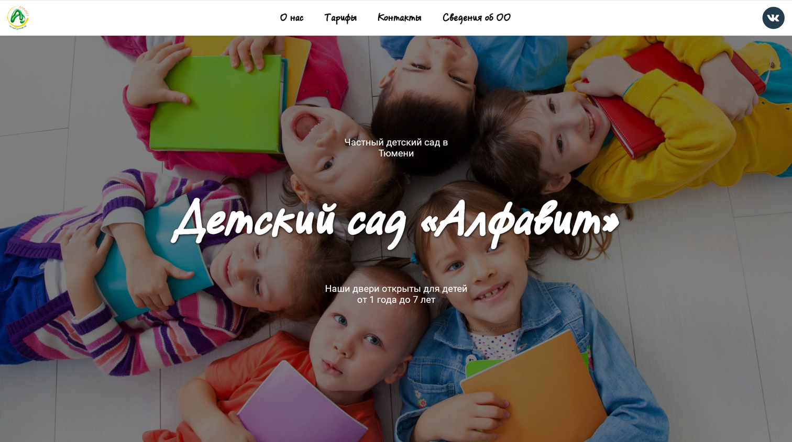
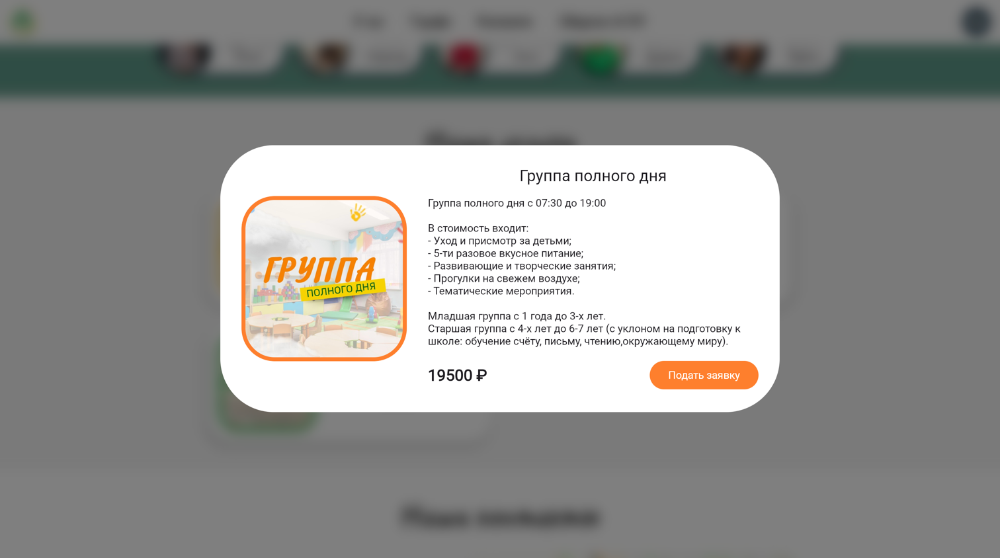

# 🌟 "Алфавит" – Веб-сайт детского сада на Compose Multiplatform (WASM/JS)

Репозиторий веб-сайта детского сада "Алфавит", разработанного с использованием **Compose Multiplatform** и WebAssembly (WASM/JS). Этот проект демонстрирует возможности Jetpack Compose для кроссплатформенной разработки, объединяя удобство декларативного UI с возможностями веб-технологий.
### [🌐 Актуальная версия сайта на GitHub Pages](https://mark3317.github.io/alfavit-web/)

---

## 🚀 Особенности
✅ **Compose Multiplatform (WASM/JS)** – современный declarative UI-фреймворк от JetBrains.  
✅ **WebAssembly** – высокая производительность и нативное исполнение в браузере.  
✅ **Адаптивный дизайн** – поддержка различных экранов и устройств.  
✅ **Легкость развертывания** – можно хостить на любом статическом сервере.

---

## 🛠️ Технологии
🔹 **Kotlin** – основной язык разработки.  
🔹 **Compose for Web (WASM/JS)** – декларативный UI.  
🔹 **Koin** – мультиплатформенная библиотека для внедрения зависимостей (DI) с использованием Koin Annotation.

---

## 📦 Установка и запуск

2️⃣ **Запустите сборку проекта:**
```sh
./gradlew wasmJsBrowserDevelopmentRun
```

3️⃣ **Откройте сайт в браузере:**
Проект автоматически откроется в `http://localhost:8080`

---

## 📸 Скриншоты
| Главная страница | Услуги                               |
|-----------------|--------------------------------------|
|  |  |
